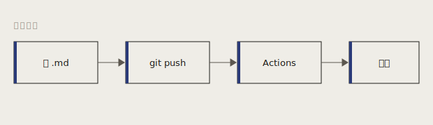

你好。这篇是专门用来给新样式做"体检"的——把所有排版元素都过一遍，你在页面上看到的样子，就是日后每篇文章会有的样子。

## 一段普通正文

中文长文阅读，最重要的就是**行距**和**字号**。这套样式把正文设成 17px、行距 1.78，衬线字体（Charter → 思源宋体），窄栏左对齐。希望你能感到"读起来不累"。

> 好的排版是隐形的。读者不会夸"这行距真棒"，他们只会不知不觉地读完一整篇。
>
> ——某个排印痴迷者

## 代码块

代码块用 Shiki 高亮、零圆角、右上角有复制按钮：

```javascript
// 一个防抖函数，前端入门常客
function debounce(fn, delay) {
  let timer = null;
  return (...args) => {
    clearTimeout(timer);
    timer = setTimeout(() => fn(...args), delay);
  };
}

const search = debounce((q) => console.log('searching:', q), 300);
search('hello');
```

行内代码也支持：用 `npm run dev` 起本地，`git push` 发布。

## 列表

无序列表：

- 极简主义不是"少东西"，是"只留对的"
- 留白是给内容喘息的空间
- 克制用色，一个强调色足够

有序列表：

1. 写 Markdown
2. `git push`
3. Actions 自动构建部署

## 配图

下面这张图演示截图/配图的用法——图片跟文章同目录，用相对路径 `./hello-again/diagram.svg` 引用，Astro 自动处理：



## 一点强调

*斜体* 和 **粗体** 都正常工作。链接也正常：去 [MDN](https://developer.mozilla.org/) 查文档。

---

到这里如果每一段都看着顺眼，说明样式成了。这篇随时可以删——它只是个体检报告。
